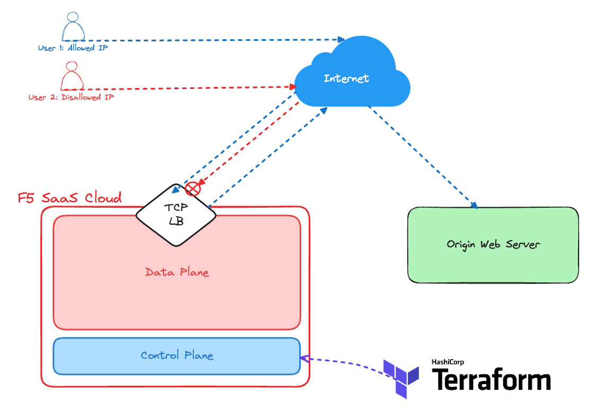

# Automating XC TCP Load Balancers with Terraform

This terraform code:
- Uses the `volterraedge/volterra` Terraform provider
- Deploys N-Number TCP Load Balancers defined in `locals.tf`
    - Load balancers listen on Anycast public IP in all XC RE locations
- Deploys N-Number origin pools defined in `locals.tf`
- Associates a service policy per load balancer with a source IP access-control-list defined in `locals.tf` 